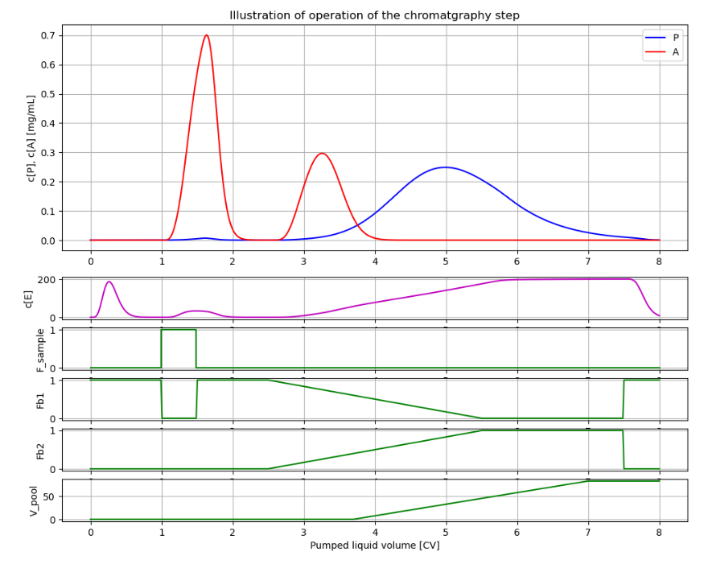

# BPL_IEC_operation

This notebook show ion exchange chromatography in laboratory scale.  The model describes separation 
of two proteins, desired product P and an antagonist A. The simulation goes through the differents
steps: equlibration, sample-adsorption, washing 1, desorption, washing 2, and finally equlibration and preparation
for the next batch. Simulation is done using an FMU from Bioprocess Library *for* Modelica. Below a diagramwith a typical 
simulation that you will get at the end of the Jupyter notebook.
 

You see in the diagram typical resuts during operation.
* The upper diagrams shows the concenration of the two proteins P and A at the outlet of the chromatography column.
* The next diagram show the salt concentration during operation.
* The following four diagrams with green curves show the following flow rates: flow of sample, flow of adsorptioin buffer, flow of desorption buffer and finally the volume of the harvested material.

You start up the notebook in Colab by pressing here
[start BPL notebook](https://colab.research.google.com/github/janpeter19/BPL_IEC_operation/blob/main/BPL_IEC_operation_colab.ipynb)
or alternatively (experimentally)
[start BPL notebook with FMPy](https://github.com/janpeter19/BPL_IEC_operation/blob/main/BPL_IEC_operation_fmpy_colab.ipynb).
Then you in the menu choose Runtime/Run all. The installation of software on the remote Google server takes a few minutes. The subsequent execution of the simulations of IEC operation take just a seconds or so. 

You can continue in the notebook and make new simulations and follow the examples given. Here are many things to explore!

See also the related repository: BPL_IEC_validation.

Note that:
* The script occassionaly get stuck during installation. Then just close the notebook and start from scratch.
* Remember, you need to have a google-account!

Just to be clear, no installation is done at your local computer.

Work in progress - stay tuned!

License information:
* The binary-file with extension FMU is shared under the permissive MIT-license
* The other files are shared under the GPL 3.0 license

